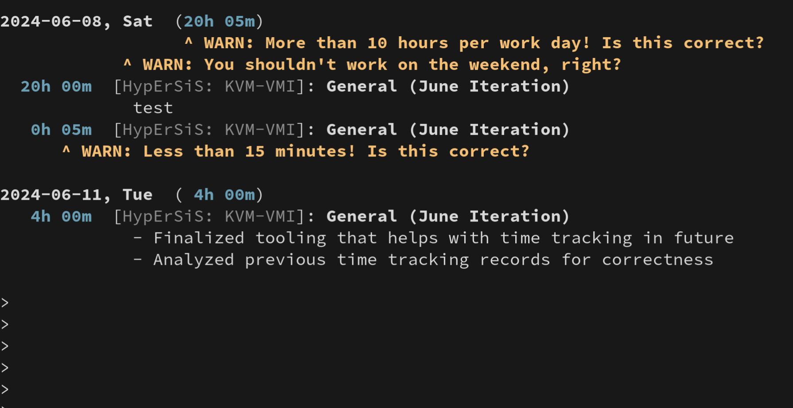

# gitlab-timelogs CLI

This CLI collects all timelogs to all tickets for the past days in the
provided GitLab instance and prints them out in a helpful way. The tool works
around various limitations of the very bad (as of Mid-2024) GitLab UI support
for timelogs.

## Target Audience

Developers who track their times in GitLab issues. Use it to check if you:
- accounted your full 8 hours of time per day split across multiple
  tickets
- didn't account time to a Saturday or Sunday (which we normally don't do), and
- to check if you accounted more than 10h for a day (normally not legally
  possible in Germany)

## Install

Via cargo:
- `cargo install --git https://gitlab.vpn.cyberus-technology.de/pschuster/gitlab-timelogs`

Via Nix:
- Option A: add this flake as input and add the package into your system config
- Option B: `$ nix shell git+ssh://git@gitlab.vpn.cyberus-technology.de/pschuster/gitlab-timelogs.git\?ref=main`

## Usage

- `$ gitlab-timelogs --help`
- `$ gitlab-timelogs --host gitlab.vpn.cyberus-technology.de --username pschuster --token ********** --days 3`

You can provide all parameters also as environment variable.
